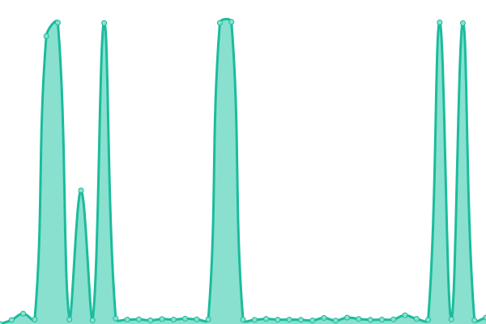

# [📈 Live Status](https://daddybannk.github.io/uptime): <!--live status--> **🟧 Partial outage**

This repository contains the open-source uptime monitor and status page for [Sahachai Y.](sahachai.net), powered by [Upptime](https://github.com/upptime/upptime).

With [Upptime](https://upptime.js.org), you can get your own unlimited and free uptime monitor and status page, powered entirely by a GitHub repository. We use [Issues](https://github.com/daddybannk/uptime/issues) as incident reports, [Actions](https://github.com/daddybannk/uptime/actions) as uptime monitors, and [Pages](https://daddybannk.github.io/uptime) for the status page.

<!--start: status pages-->
<!-- This summary is generated by Upptime (https://github.com/upptime/upptime) -->
<!-- Do not edit this manually, your changes will be overwritten -->
<!-- prettier-ignore -->
| URL | Status | History | Response Time | Uptime |
| --- | ------ | ------- | ------------- | ------ |
|  [sahachai.net](https://www.sahachai.net) | 🟩 Up | [sahachai-net.yml](https://github.com/daddybannk/uptime/commits/HEAD/history/sahachai-net.yml) | 

 176ms
     
 | 

<a href="https://daddybannk.github.io/uptime/history/sahachai-net">100.00%</a>
    

|  [minecraft server (6365, 6366)](http://sahachai.thddns.net:6366) | 🟥 Down | [minecraft-server-6365-6366.yml](https://github.com/daddybannk/uptime/commits/HEAD/history/minecraft-server-6365-6366.yml) | 

 0ms
     
 | 

<a href="https://daddybannk.github.io/uptime/history/minecraft-server-6365-6366">0.00%</a>
    

|  [render webhook line notify](https://node-ts-webhook.onrender.com) | 🟥 Down | [render-webhook-line-notify.yml](https://github.com/daddybannk/uptime/commits/HEAD/history/render-webhook-line-notify.yml) | 

 14711ms
     
 | 

<a href="https://daddybannk.github.io/uptime/history/render-webhook-line-notify">67.52%</a>
    

<!--end: status pages-->

[**Visit our status website →**](https://daddybannk.github.io/uptime)

## 📄 License

- Powered by: [Upptime](https://github.com/upptime/upptime)
- Code: [MIT](./LICENSE) © [Sahachai Y.](sahachai.net)
- Data in the `./history` directory: [Open Database License](https://opendatacommons.org/licenses/odbl/1-0/)
